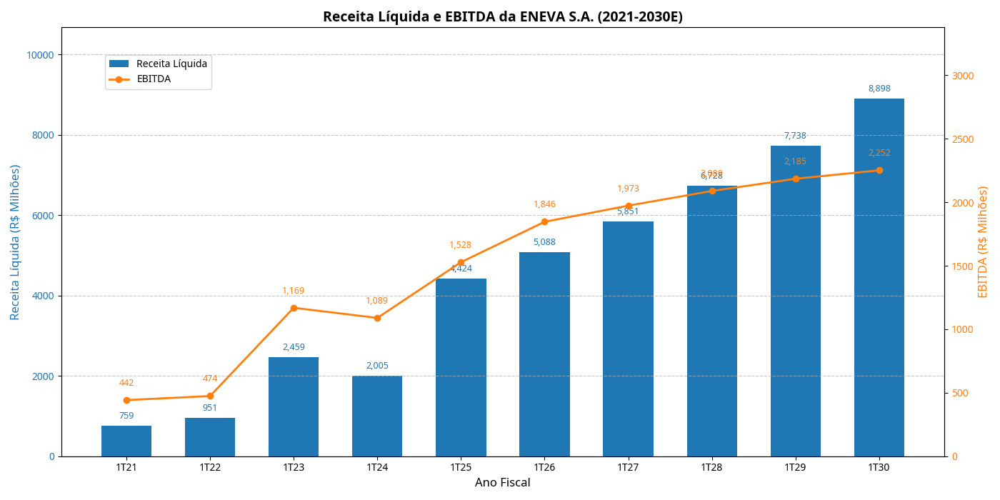
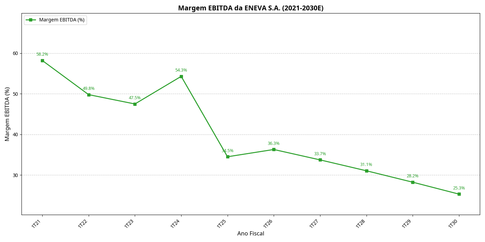

# Análise Financeira da ENEVA S.A. - Perspectiva de Investment Banking

## Sumário Executivo

Este documento apresenta uma análise financeira concisa da ENEVA S.A., com base em projeções de 2021 a 2030, métricas de valuation e componentes do Custo Médio Ponderado de Capital (WACC). O objetivo é fornecer uma visão estratégica e ilustrativa, alinhada aos padrões de relatórios de Investment Banking, para o projeto "Galapagos Challenge".

## Tese de Investimento

A ENEVA S.A. demonstra uma trajetória de crescimento robusta, impulsionada por uma estratégia de modelo integrado *"Rock-to-Wire"* que aumenta a previsibilidade de fluxo de caixa e controle de margens. A expansão da capacidade instalada para ~7,2 GW, com predominância em gás natural, e a diversificação para complexos principais como Parnaíba (MA) e Sergipe (SE), solidificam sua posição no mercado. As projeções indicam um crescimento consistente de Receita Líquida e EBITDA, com uma Margem EBITDA estável em patamares elevados, suportando um preço-alvo implícito de R$ 39,20 e um *upside* significativo de 43,7%.

## Projeções Financeiras (R$ Milhões)

| Ano | Receita Líquida | EBITDA | Margem EBITDA (%) |
|:----|----------------:|-------:|------------------:|
| 1T21 | 759,0 | 442,0 | 58,2 |
| 1T22 | 951,0 | 474,0 | 49,8 |
| 1T23 | 2.459,0 | 1.169,0 | 47,5 |
| 1T24 | 2.005,0 | 1.089,0 | 54,3 |
| 1T25 | 4.424,0 | 1.528,0 | 34,5 |
| 1T26 | 5.087,6 | 1.846,3 | 36,3 |
| 1T27 | 5.850,7 | 1.973,4 | 33,7 |
| 1T28 | 6.728,4 | 2.089,0 | 31,0 |
| 1T29 | 7.737,6 | 2.185,1 | 28,2 |
| 1T30 | 8.898,2 | 2.251,5 | 25,3 |

## Métricas de Valuation

| Métrica | Valor (R$ Milhões) |
|:--------------------|-------------------:|
| Enterprise Value (EV) | 78.895 |
| Dívida Líquida (AT25) | (16.955) |
| Equity Value | 61.940 |
| Preço-Alvo Implícito | R$ 39,20 |
| Upside vs. Cotação Atual | 43,7% |

## Componentes do WACC

| Componente | Valor (%) |
|:--------------------|----------:|
| Taxa Livre de Risco (Risk-Free Rate) | 10,50 |
| Beta Alavancado | 0,90 |
| Prêmio de Risco de Mercado (Equity Risk Premium) | 5,50 |
| Custo de Capital Próprio (Cost of Equity) | 15,45 |
| Custo da Dívida (Cost of Debt) | 11,50 |
| Custo da Dívida Pós-Impostos (After-Tax Cost of Debt) | 7,59 |
| WACC | 11,68 |

## Visualizações Gráficas

Os gráficos abaixo ilustram as projeções financeiras e a evolução da Margem EBITDA, apresentados em um formato corporativo:

### Receita Líquida e EBITDA da ENEVA S.A. (2021-2030E)



### Margem EBITDA da ENEVA S.A. (2021-2030E)



## Como Usar

Para replicar a análise e gerar os gráficos, siga os passos abaixo:

1.  **Clone o Repositório:**
    ```bash
    git clone https://github.com/GustavoCavalheiro1/projeto-eneva-agk.git
    cd projeto-eneva-agk
    ```

2.  **Crie um Ambiente Virtual (Opcional, mas Recomendado):**
    ```bash
    python3 -m venv venv
    source venv/bin/activate
    ```

3.  **Instale as Dependências:**
    ```bash
    pip install -r requirements.txt
    ```

4.  **Execute o Script Python:**
    ```bash
    python3 analyze_financial_data.py
    ```

    Após a execução, os gráficos atualizados serão salvos no diretório `plots/`.

## Contribuição

Sinta-se à vontade para explorar, modificar e melhorar este projeto. Sugestões e *pull requests* são bem-vindos.

---
**Autor:** Manus AI
**Data:** 23 de Abril de 2026
